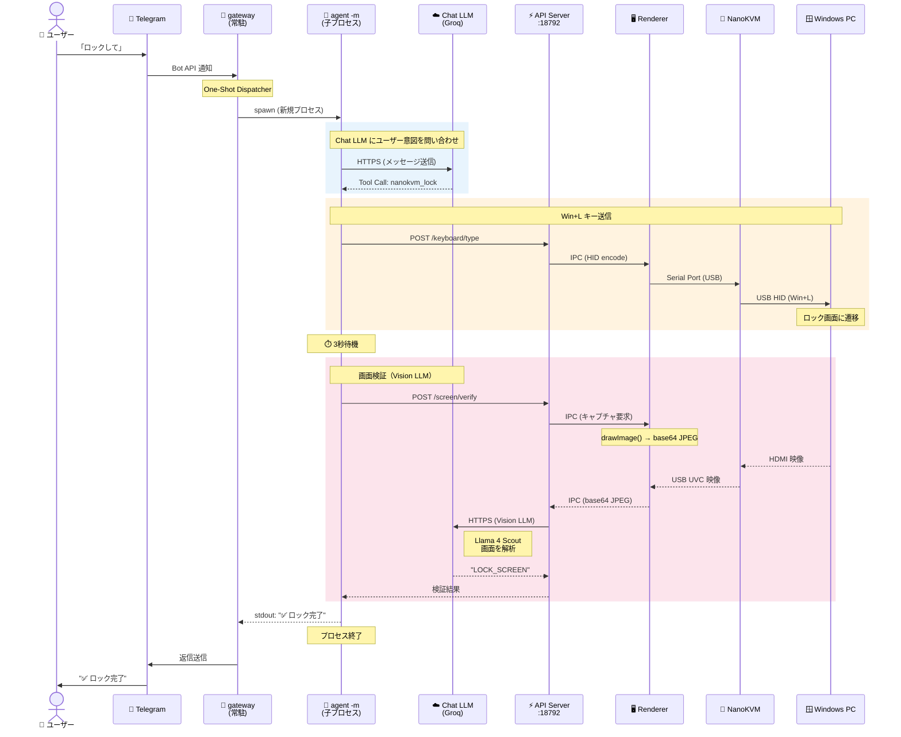

# picoclaw によるリモート Windows ロック・ログイン機能仕様書

> **最終更新**: 2026-02-24

## 概要

NanoKVM-USB デスクトップアプリに組み込まれた AI エージェント「picoclaw」を通じて、自然言語の指示でリモート接続された Windows PC のロック・ログイン操作を行う機能です。

**入力経路**: チャット UI（アプリ内）または Telegram ボット  
**出力先**: NanoKVM-USB ハードウェア経由で Windows PC に HID キーボード入力を送信  
**処理方式**: 両経路とも `picoclaw agent -m` を毎回サブプロセスとして起動（One-Shot 方式）

---

## システム構成ブロック図

### 全体アーキテクチャ


### Telegram ロック操作のシーケンス図



**データフローの要点**:

| 方向 | フロー | 説明 |
|------|--------|------|
| **➡️ 操作** | Chat/Telegram → picoclaw agent -m → Chat LLM → Tool Call → API Server → Renderer → Serial Port → NanoKVM → Windows PC | キー・マウス操作の送信 |
| **⬅️ 映像** | Windows PC → HDMI → NanoKVM → USB (UVC) → Renderer `<video>` (getUserMedia) | HDMI 映像のリアルタイム表示 |
| **🔄 検証** | API Server → Renderer canvas キャプチャ → base64 JPEG → Vision LLM (Groq) → 判定結果 | 画面キャプチャ + Vision 解析 |

---

## 対応コマンド

### 1. ロック（画面ロック）

| 項目 | 内容 |
|------|------|
| **操作内容** | Windows のショートカット `Win + L` を送信 |
| **対応フレーズ例** | 「Windowsをロックして」「PCをロックしてください」「ロック」「lock the screen」 |
| **内部動作** | `Win` キー押下 → `L` キー押下 → 100ms 保持 → 逆順にリリース |
| **事後検証** | 3秒後に画面キャプチャ → Vision LLM で LOCK_SCREEN を確認 |

### 2. ログイン（PIN / パスワード入力）

| 項目 | 内容 |
|------|------|
| **操作内容** | ロック画面を解除し、PIN コードまたはパスワードを入力してログイン |
| **対応フレーズ例** | 「PINコード mypin でログインして」「パスワードで入って」「login with PIN」 |
| **事後検証** | 15秒後に画面キャプチャ → Vision LLM で結果を判定 |

#### ログインシーケンス（PIN のみ）

| ステップ | 操作 | 目的 | 待機時間 |
|----------|------|------|----------|
| 0 | `Escape` キー押下 | 前回のPINエラーダイアログが残っている場合に閉じる | 300ms |
| 1 | `Space` キー押下 | ロック画面からサインイン画面を呼び起こす | 500ms |
| 1b | `Space` キー再押下 | バックアップの起動操作 | - |
| 2 | 待機 | Windows がPIN入力欄を描画・フォーカスするのを待つ | 3,000ms |
| 3 | `Backspace` × 20回 | 入力欄の既存文字をクリア（Ctrl+A はPIN欄で無効のため） | 各30ms間隔 |
| 4 | PIN を1文字ずつ入力 | HID キーボードレポートで各文字を送信 | 各150ms間隔 |
| 5 | `Enter` キー押下 | PIN を送信してログイン | - |

#### ログインシーケンス（ユーザー名 + パスワード）

| ステップ | 操作 | 目的 | 待機時間 |
|----------|------|------|----------|
| 0 | `Escape` キー押下 | エラーダイアログを閉じる（前回失敗時の残り） | 300ms |
| 1〜3 | 上記と同じ | 画面起動・フィールドクリア | 同上 |
| 4 | ユーザー名を入力 | ユーザー名欄にテキスト入力 | 300ms |
| 5 | `Tab` キー押下 | パスワード欄に移動 | 300ms |
| 6 | パスワードを入力 | パスワード欄にテキスト入力 | 300ms |
| 7 | `Enter` キー押下 | ログイン実行 | - |

> **Note**: ユーザーが明示的に指定しない限り、ユーザー名は送信されません。LLM が OS 名やボット名をユーザー名として使用することを防ぐバリデーションが入っています。

---

## picoclaw ツール呼び出しの流れ

picoclaw は Go 側でネイティブなツール実行（function calling）を行います。
また、LLM がテキスト中にツール呼び出しを埋め込むケースに備え、
Electron 側のインターセプター（`manager.ts`）がフォールバック検出を行います。

### Go 側ネイティブツール（主要パス）

picoclaw agent はツール定義を LLM に渡し、構造化された function call で実行します:

| ツール名 | 説明 | パラメータ |
|----------|------|-----------|
| `nanokvm_lock` | Win+L でロック | なし |
| `nanokvm_login` | PIN/パスワード入力でログイン | `password`, `username?` |
| `nanokvm_shortcut` | キーボードショートカット送信 | `keys[]` |
| `nanokvm_type` | テキスト入力 | `text` |
| `nanokvm_mouse_click` | マウスクリック | `button` |

### Electron 側インターセプター（フォールバック）

LLM がテキスト出力にツール呼び出しを含めた場合の検出パターン（3形式対応）:

| 優先度 | フォーマット | 例 |
|--------|-------------|-----|
| 1 | アクションタグ | `<<nanokvm:login:mypin>>` |
| 2 | JSON オブジェクト | `{"type":"function","name":"nanokvm_login","parameters":{"password":"..."}}` |
| 3 | Python 関数呼び出し | `nanokvm_login(password='...')` |

### 重複実行防止

- 同一エンドポイント + 同一パラメータのリクエストは **15秒間の重複排除**（debounce）
- Go 側がネイティブ実行 → HTTP API 呼び出し → インターセプターも同じ API を呼ぼうとする → debounce で弾かれる

---

## レスポンスメッセージ

ユーザーに表示するメッセージは、LLM 出力からツール呼び出し構文を除去（`stripActionTags`）して生成されます。

### 除去対象

- `<<nanokvm:...>>` アクションタグ
- `nanokvm_` を含む JSON オブジェクト
- `nanokvm_xxx(...)` 関数呼び出し構文
- LLM プリアンブル文（例: "The function call that best answers the prompt is:"）

### フォールバック

除去後にテキストが空になった場合、「コマンドを実行しました」がデフォルトメッセージとして表示されます。

---

## 対応キー名

ショートカットで使用できるキー名はLLMの出力する一般的な名前から自動変換されます。

| 入力名 | 変換先（HID コード） |
|--------|---------------------|
| Win, Windows, Meta, Cmd | MetaLeft |
| Ctrl, Control | ControlLeft |
| Alt, Option | AltLeft |
| Shift | ShiftLeft |
| Del | Delete |
| Esc | Escape |
| Return | Enter |
| A〜Z（単一文字） | KeyA〜KeyZ |
| 0〜9（単一数字） | Digit0〜Digit9 |
| F1〜F24 | F1〜F24 |

---

## API エンドポイント一覧

HTTP API サーバー（`127.0.0.1:18792`）が提供するエンドポイント:

| メソッド | パス | パラメータ | 説明 |
|----------|------|-----------|------|
| POST | `/api/keyboard/shortcut` | `{"keys": ["Win", "L"]}` | キーボードショートカット送信 |
| POST | `/api/keyboard/login` | `{"password": "...", "username?": "user"}` | Windows ログイン実行 |
| POST | `/api/keyboard/type` | `{"text": "Hello"}` | テキスト入力 |
| POST | `/api/mouse/click` | `{"button": "left"}` | マウスクリック |
| GET | `/api/screen/capture` | なし | 現在の画面をキャプチャ（base64 JPEG） |
| POST | `/api/screen/verify` | `{"action": "lock"\|"login"}` | 画面状態を Vision LLM で検証 |

---

## 入力経路別の挙動

| 項目 | チャット UI | Telegram |
|------|------------|----------|
| **picoclaw 常駐プロセス** | なし（都度起動） | `picoclaw gateway`（常駐） |
| **メッセージ処理** | `manager.ts` → `spawn agent -m` | One-Shot Dispatcher → `spawn agent -m` |
| **LLM 呼び出し** | サブプロセス内 | サブプロセス内（同一） |
| **ツール実行** | Go 側ネイティブ | Go 側ネイティブ（同一） |
| **レスポンス表示** | チャット吹き出し | Telegram メッセージ |
| **セッション蓄積** | なし（毎回フレッシュ） | なし（毎回フレッシュ） |

---

## 制約事項

- **同時押しキー数**: HID 仕様により最大6キー（修飾キーは別枠）
- **文字入力**: ASCII 英数字・基本記号のみ対応（日本語入力は非対応）
- **マウス移動**: 座標指定は未実装（クリックのみ対応）
- **ログイン待機**: PIN 入力後 15 秒の固定待機（デスクトップ描画完了まで）
- **NanoKVM 操作回数**: 1メッセージあたり最大 4 回（不要な反復を防止）
- **ユーザー名バリデーション**: "windows", "linux", "ubuntu" 等の OS 名は自動除外

---

## 画面検証機能（Vision LLM）

ロック・ログインコマンド実行後、NanoKVM-USB の HDMI キャプチャ映像をスクリーンキャプチャし、**専用の Vision LLM** で画面内容を解析して結果を自動判定します。

### 設計思想: チャット用 LLM と Vision LLM の分離

```
┌─────────────────────────────────────────────────┐
│  設定画面 (picoclaw.tsx)                         │
│                                                  │
│  ── チャット LLM ──                              │
│  [Provider] Groq                                │
│  [API Key]  gsk_...                             │
│  [Model]    llama-3.1-8b-instant                │
│                                                  │
│  ── 👁️ 画面検証 Vision LLM ──                  │
│  [Provider] Groq                                │
│  [API Key]  gsk_... (共有可)                     │
│  [Model]    Llama 4 Scout 17B 👁️               │
└─────────────────────────────────────────────────┘
```

**理由**: チャットには安価なテキスト LLM、画面検証には Vision 対応 LLM という使い分け。
例: チャット = llama-3.1-8b-instant (Groq 無料) + Vision = Llama 4 Scout (Groq 無料)

### 検証フロー

```
┌─────────────────────┐
│ ロック or ログイン    │
│ コマンド実行          │
└──────────┬──────────┘
           │
           ▼
┌─────────────────────┐
│ HID キー入力送信      │
│ (Win+L or PIN入力)   │
└──────────┬──────────┘
           │
           ▼
┌─────────────────────┐     ┌──────────────────────┐
│ 待機                 │     │ 待機時間:             │
│ (ロック: 3s)         │     │  Lock: 3秒           │
│ (ログイン: 15s)      │     │  Login: 15秒          │
│                      │     │  (Ollama: 各 +2〜3秒) │
└──────────┬──────────┘     └──────────────────────┘
           │
           ▼
┌─────────────────────┐
│ callScreenVerify()   │
│ HTTP POST            │
│ /api/screen/verify   │
└──────────┬──────────┘
           │
           ▼
┌─────────────────────┐     ┌──────────────────────┐
│ API Server           │     │ HDMI → canvas →       │
│ スクリーンキャプチャ   │────▶│ base64 JPEG           │
│ + Vision LLM 呼び出し │     └──────────────────────┘
└──────────┬──────────┘
           │
     ┌─────┴─────────────────────────────┐
     │           Vision LLM 判定          │
     ├────────────┬────────────┬──────────┤
     ▼            ▼            ▼          ▼
 LOCK_SCREEN  LOGIN_SUCCESS  LOGIN_FAILED  DESKTOP
     │            │            │          │
     ▼            ▼            ▼          ▼
  ロック時:     ログイン時:   ログイン時:  ロック時:
  ✅ 成功      ✅ 成功      ❌ 失敗     ⚠️ 失敗
                             + Enter で
                             エラー解除
```

### Vision プロンプト

Vision LLM には画面内容に応じた専用プロンプトを使用:

- **ロック検証**: "Is this a Windows lock screen or a desktop?" → `LOCK_SCREEN` / `DESKTOP`
- **ログイン検証**: "What is the Windows login status?" → `LOGIN_SUCCESS` / `LOGIN_FAILED` / `LOCK_SCREEN`
  - タスクバーの有無を重視（タスクバーが見える = デスクトップ = LOGIN_SUCCESS）

### NanoKVM 操作の早期終了条件

Vision 検証の結果が以下のいずれかを含むとき、picoclaw は追加の LLM 呼び出しを行わず即座にユーザーに結果を返します:

| 結果 | 条件 | 動作 |
|------|------|------|
| ✅ 成功 | 応答に ✅ を含む | 早期終了・成功として返却 |
| ❌ 失敗 | 応答に ❌ / LOGIN_FAILED を含む | 早期終了・失敗として返却 |
| ⚠️ 未完了 | 応答に ⚠️ / LOCK_SCREEN を含む | 早期終了・警告として返却 |

これにより、不要な反復 LLM 呼び出し（→ 429 エラー）を防止します。

### Vision LLM 未設定時の振る舞い

Vision LLM が設定されていない場合:
- **事後検証**: Go 側で `callScreenVerify()` が呼ばれるが、API Server が「未設定」を返却
- ツール結果は「✅ 操作完了」で返される（検証なし）
- 初回操作時に設定案内メッセージが表示される

### Vision LLM 対応モデル一覧

| プロバイダ | モデル | 料金 | 速度 | 備考 |
|-----------|--------|------|------|------|
| **Groq** | **Llama 4 Scout 17B** | **無料** | 高速 (~500ms) | **推奨**: クレカ不要 |
| **Groq** | Llama 4 Maverick 17B | **無料** | 高速 | 高精度 |
| **Groq** | Llama 3.2 11B Vision | **無料** | 高速 | レガシー |
| **Groq** | Llama 3.2 90B Vision | **無料** | 低速 | 高精度 |
| **Ollama** | Moondream2 (1.7B) | **無料** | ~60秒 | ローカル・CPU向き |
| **Ollama** | LLaVA (7B) | **無料** | ~3分 | ローカル・高精度 |
| OpenRouter | Gemini 2.0 Flash | 安価 | 高速 | API キー共有可 |
| OpenAI | GPT-4o Mini | 安価 | 高速 | - |
| OpenAI | GPT-4o | 高額 | 中速 | 高精度 |
| Anthropic | Claude 3.5 Haiku | 安価 | 高速 | - |
| Anthropic | Claude 3.5 Sonnet | 高額 | 中速 | 高精度 |

### タイムアウト設定

| プロバイダ | 検証遅延 (ロック) | 検証遅延 (ログイン) | API タイムアウト |
|-----------|------------------|-------------------|----------------|
| クラウド (Groq等) | 3秒 | 15秒 | 30秒 |
| Ollama (ローカル) | 5秒 | 15秒 | 120秒 |

### Config 構造

```json
{
  "agents": {
    "defaults": {
      "provider": "groq",
      "model": "llama-3.1-8b-instant",
      "vision_provider": "groq",
      "vision_model": "meta-llama/llama-4-scout-17b-16e-instruct"
    }
  },
  "providers": {
    "groq": { "api_key": "gsk_..." }
  },
  "model_list": {
    "groq": ["llama-3.1-8b-instant", "meta-llama/llama-4-scout-17b-16e-instruct"]
  }
}
```

### レートリミット対策

Groq 無料枠（TPM 6000）での運用を前提とした対策:

| 対策 | 説明 |
|------|------|
| One-Shot 方式 | セッション蓄積なし → トークン消費を最小化 |
| 早期終了 | ✅/❌/⚠️ で即座に返却 → 追加 LLM 呼び出し不要 |
| NanoKVM 回数制限 | 1メッセージあたり最大 4 回 |
| REDACTED 拒否 | LLM がパスワードを *** にマスクした場合は実行拒否 |
| 429 ポップアップ | レートリミット時にリトライ待ち時間を UI に表示 |
