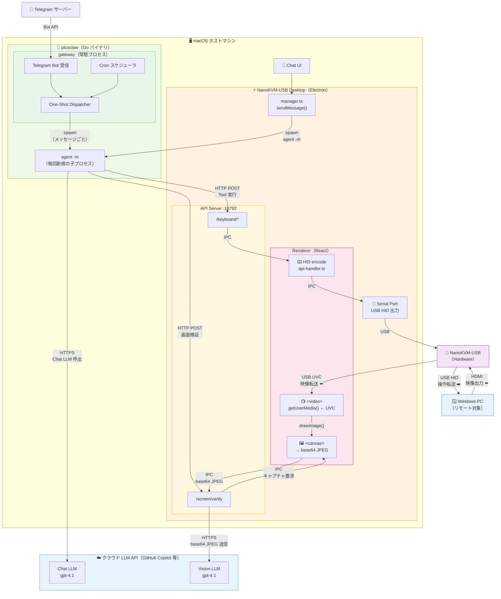
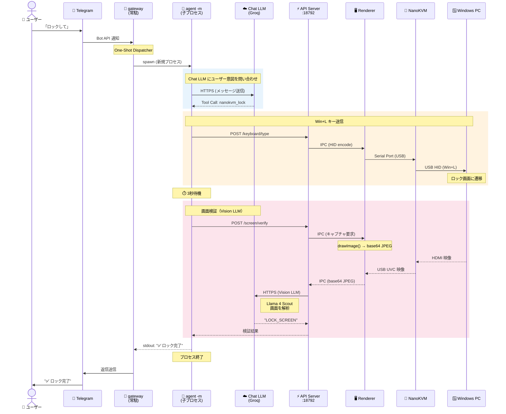
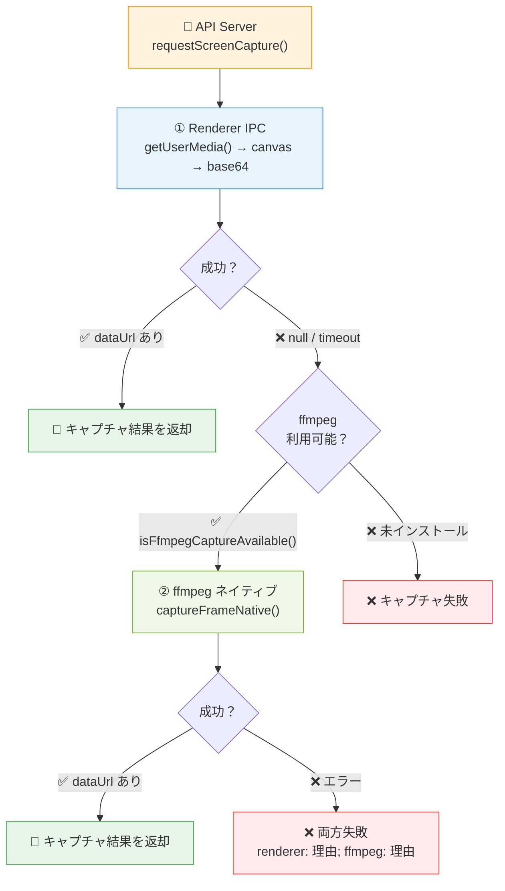
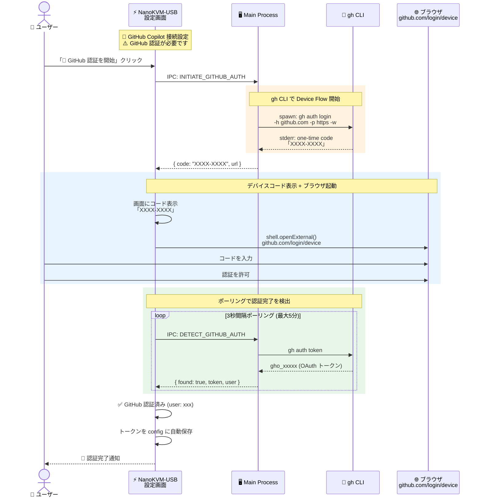
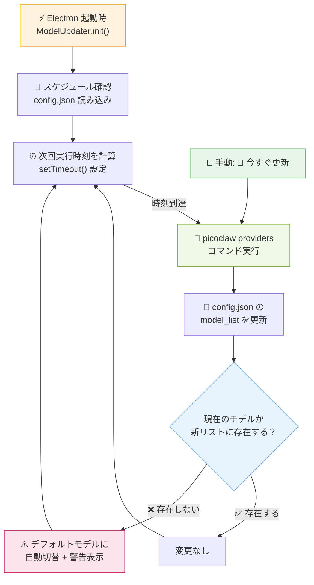
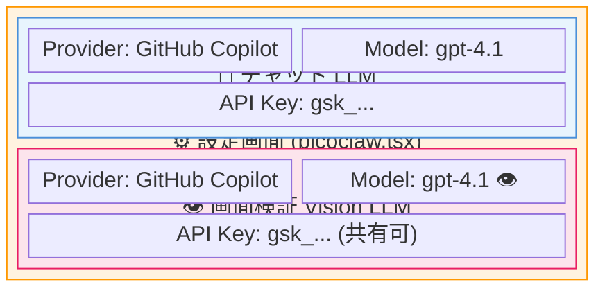
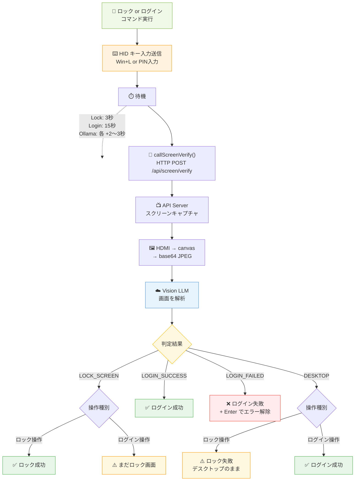

# picoclaw によるリモート Windows ロック・ログイン機能仕様書

> **最終更新**: 2026-02-27 (v2026.02.27)

## 概要

NanoKVM-USB デスクトップアプリに組み込まれた AI エージェント「picoclaw」を通じて、自然言語の指示でリモート接続された Windows PC のロック・ログイン操作を行う機能です。

**入力経路**: チャット UI（アプリ内）または Telegram ボット  
**出力先**: NanoKVM-USB ハードウェア経由で Windows PC に HID キーボード入力を送信  
**処理方式**: 両経路とも `picoclaw agent -m` を毎回サブプロセスとして起動（One-Shot 方式）

---

## システム構成ブロック図

### 全体アーキテクチャ



### Telegram ロック操作のシーケンス図



**データフローの要点**:

| 方向 | フロー | 説明 |
|------|--------|------|
| **➡️ 操作** | Chat/Telegram → picoclaw agent -m → Chat LLM → Tool Call → API Server → Renderer → Serial Port → NanoKVM → Windows PC | キー・マウス操作の送信 |
| **⬅️ 映像** | Windows PC → HDMI → NanoKVM → USB (UVC) → Renderer `<video>` (getUserMedia) | HDMI 映像のリアルタイム表示 |
| **🔄 検証** | API Server → Renderer canvas キャプチャ → base64 JPEG → Vision LLM (Groq) → 判定結果 | 画面キャプチャ + Vision 解析 |

---

## 対応コマンド

### 1. ロック（画面ロック）

| 項目 | 内容 |
|------|------|
| **操作内容** | Windows のショートカット `Win + L` を送信 |
| **対応フレーズ例** | 「Windowsをロックして」「PCをロックしてください」「ロック」「lock the screen」 |
| **内部動作** | `Win` キー押下 → `L` キー押下 → 100ms 保持 → 逆順にリリース |
| **事後検証** | 3秒後に画面キャプチャ → Vision LLM で LOCK_SCREEN を確認 |

### 2. ログイン（PIN / パスワード入力）

| 項目 | 内容 |
|------|------|
| **操作内容** | ロック画面を解除し、PIN コードまたはパスワードを入力してログイン |
| **対応フレーズ例** | 「PINコード mypin でログインして」「パスワードで入って」「login with PIN」 |
| **事後検証** | 15秒後に画面キャプチャ → Vision LLM で結果を判定 |

#### ログインシーケンス（PIN のみ）

| ステップ | 操作 | 目的 | 待機時間 |
|----------|------|------|----------|
| 0 | `Escape` キー押下 | 前回のPINエラーダイアログが残っている場合に閉じる | 200ms |
| 1 | `Space` キー押下 | ロック画面からサインイン画面を呼び起こす | 500ms |
| 1b | `Space` キー再押下 | バックアップの起動操作 | - |
| 2 | 待機 | Windows がPIN入力欄を描画・フォーカスするのを待つ | 1,500ms |
| 3 | `Backspace` × 10回 | 入力欄の既存文字をクリア（Ctrl+A はPIN欄で無効のため） | 各30ms間隔 |
| 4 | PIN を1文字ずつ入力 | HID キーボードレポートで各文字を送信 | 各80ms間隔 |
| 5 | `Enter` キー押下 | PIN を送信してログイン | - |

> **skipWake 最適化**: picoclaw 経由のログインでは、画面確認（screen_check）で既に PC が起動済みと確認されているため、S3 スリープ復帰シーケンス（5秒のマウス＋キーボードウェイク）をスキップします。これにより、ログイン所要時間が約14秒から約5秒に短縮されました。

#### ログインシーケンス（ユーザー名 + パスワード）

| ステップ | 操作 | 目的 | 待機時間 |
|----------|------|------|----------|
| 0 | `Escape` キー押下 | エラーダイアログを閉じる（前回失敗時の残り） | 300ms |
| 1〜3 | 上記と同じ | 画面起動・フィールドクリア | 同上 |
| 4 | ユーザー名を入力 | ユーザー名欄にテキスト入力 | 300ms |
| 5 | `Tab` キー押下 | パスワード欄に移動 | 300ms |
| 6 | パスワードを入力 | パスワード欄にテキスト入力 | 300ms |
| 7 | `Enter` キー押下 | ログイン実行 | - |

> **Note**: ユーザーが明示的に指定しない限り、ユーザー名は送信されません。LLM が OS 名やボット名をユーザー名として使用することを防ぐバリデーションが入っています。

---

## picoclaw ツール呼び出しの流れ

picoclaw は Go 側でネイティブなツール実行（function calling）を行います。
また、LLM がテキスト中にツール呼び出しを埋め込むケースに備え、
Electron 側のインターセプター（`manager.ts`）がフォールバック検出を行います。

### Go 側ネイティブツール（主要パス）

picoclaw agent はツール定義を LLM に渡し、構造化された function call で実行します:

| ツール名 | 説明 | パラメータ |
|----------|------|-----------|
| `nanokvm_lock` | Win+L でロック | なし |
| `nanokvm_login` | PIN/パスワード入力でログイン | `password`, `username?` |
| `nanokvm_shortcut` | キーボードショートカット送信 | `keys[]` |
| `nanokvm_type` | テキスト入力 | `text` |
| `nanokvm_mouse_click` | マウスクリック | `button` |

### Electron 側インターセプター（フォールバック）

LLM がテキスト出力にツール呼び出しを含めた場合の検出パターン（3形式対応）:

| 優先度 | フォーマット | 例 |
|--------|-------------|-----|
| 1 | アクションタグ | `<<nanokvm:login:mypin>>` |
| 2 | JSON オブジェクト | `{"type":"function","name":"nanokvm_login","parameters":{"password":"..."}}` |
| 3 | Python 関数呼び出し | `nanokvm_login(password='...')` |

### 重複実行防止

- 同一エンドポイント + 同一パラメータのリクエストは **15秒間の重複排除**（debounce）
- Go 側がネイティブ実行 → HTTP API 呼び出し → インターセプターも同じ API を呼ぼうとする → debounce で弾かれる

---

## レスポンスメッセージ

ユーザーに表示するメッセージは、LLM 出力からツール呼び出し構文を除去（`stripActionTags`）して生成されます。

### 除去対象

- `<<nanokvm:...>>` アクションタグ
- `nanokvm_` を含む JSON オブジェクト
- `nanokvm_xxx(...)` 関数呼び出し構文
- LLM プリアンブル文（例: "The function call that best answers the prompt is:"）

### フォールバック

除去後にテキストが空になった場合、「コマンドを実行しました」がデフォルトメッセージとして表示されます。

---

## 対応キー名

ショートカットで使用できるキー名はLLMの出力する一般的な名前から自動変換されます。

| 入力名 | 変換先（HID コード） |
|--------|---------------------|
| Win, Windows, Meta, Cmd | MetaLeft |
| Ctrl, Control | ControlLeft |
| Alt, Option | AltLeft |
| Shift | ShiftLeft |
| Del | Delete |
| Esc | Escape |
| Return | Enter |
| A〜Z（単一文字） | KeyA〜KeyZ |
| 0〜9（単一数字） | Digit0〜Digit9 |
| F1〜F24 | F1〜F24 |

---

## API エンドポイント一覧

HTTP API サーバー（`127.0.0.1:18792`）が提供するエンドポイント:

| メソッド | パス | パラメータ | 説明 |
|----------|------|-----------|------|
| POST | `/api/keyboard/shortcut` | `{"keys": ["Win", "L"]}` | キーボードショートカット送信 |
| POST | `/api/keyboard/login` | `{"password": "...", "username?": "user"}` | Windows ログイン実行 |
| POST | `/api/keyboard/type` | `{"text": "Hello"}` | テキスト入力 |
| POST | `/api/mouse/click` | `{"button": "left"}` | マウスクリック |
| GET | `/api/screen/capture` | なし | 現在の画面をキャプチャ（base64 JPEG） |
| POST | `/api/screen/verify` | `{"action": "lock"\|"login"\|"status"}` | 画面状態を Vision LLM で検証・確認 |

---

## 入力経路別の挙動

| 項目 | チャット UI | Telegram |
|------|------------|----------|
| **picoclaw 常駐プロセス** | なし（都度起動） | `picoclaw gateway`（常駐） |
| **メッセージ処理** | `manager.ts` → `spawn agent -m` | One-Shot Dispatcher → `spawn agent -m` |
| **LLM 呼び出し** | サブプロセス内 | サブプロセス内（同一） |
| **ツール実行** | Go 側ネイティブ | Go 側ネイティブ（同一） |
| **レスポンス表示** | チャット吹き出し | Telegram メッセージ |
| **セッション蓄積** | なし（毎回フレッシュ） | なし（毎回フレッシュ） |

---

## 制約事項

- **同時押しキー数**: HID 仕様により最大6キー（修飾キーは別枠）
- **文字入力**: ASCII 英数字・基本記号のみ対応（日本語入力は非対応）
- **マウス移動**: 座標指定は未実装（クリックのみ対応）
- **ログイン待機**: PIN 入力後 15 秒の固定待機（デスクトップ描画完了まで）
- **NanoKVM 操作回数**: 1メッセージあたり最大 4 回（不要な反復を防止）
- **ユーザー名バリデーション**: "windows", "linux", "ubuntu" 等の OS 名は自動除外

---

## ffmpeg バンドルとクロスプラットフォーム対応

画面キャプチャ機能（macOS ロック中のフォールバック）で使用する ffmpeg は、`ffmpeg-static` npm パッケージを通じてアプリにバンドルされます。

### バンドル方式

| 項目 | 内容 |
|------|------|
| **パッケージ** | `ffmpeg-static` v5.3.0（静的リンク済みバイナリ） |
| **配置場所** | `electron-builder.yml` の `extraResources` で `<app>/Contents/Resources/bin/ffmpeg` にコピー |
| **バイナリサイズ** | 約 70〜80MB（プラットフォームにより異なる） |
| **検索優先順位** | ① バンドル済み → ② `/usr/local/bin/ffmpeg` → ③ `/opt/homebrew/bin/ffmpeg` → ④ `/usr/bin/ffmpeg` |

### プラットフォーム対応

| プラットフォーム | キャプチャ方式 | デバイス検出 | 状態 |
|----------------|-------------|------------|------|
| **macOS (Intel)** | AVFoundation | `[index] Device Name` | ✅ 動作確認済み |
| **macOS (Apple Silicon)** | AVFoundation | 同上 | ✅ 対応（ffmpeg-static が arm64 バイナリを提供） |
| **Windows** | DirectShow | `"Device Name"` | 🔧 実装済み（未テスト） |
| **Linux** | — | — | ❌ 未対応 |

### Windows 対応の実装詳細

Windows では ffmpeg の DirectShow 入力を使用して USB キャプチャカードから映像を取得します:

```
ffmpeg -f dshow -video_size 1920x1080 -i "video=USB3 Video" -frames:v 1 -f image2pipe -vcodec mjpeg -q:v 5 -
```

- デバイス検出: `ffmpeg -f dshow -list_devices true -i dummy` でデバイス名を取得
- 入力指定: `video=<デバイス名>` 形式（AVFoundation のインデックス指定とは異なる）
- バイナリ名: `ffmpeg.exe`（`ffmpeg-static` がビルドプラットフォームに応じて自動選択）

> **Note**: Windows では macOS ロック時のような Renderer スロットリング問題は通常発生しませんが、リモートデスクトップ切断時等に同様の状況が起こる可能性があるため、ffmpeg フォールバックを共通基盤として実装しています。

---

## ffmpeg キャプチャ実装アーキテクチャ

### 2段階フォールバック設計

画面キャプチャは **Renderer IPC（高速パス）** と **ffmpeg ネイティブキャプチャ（フォールバック）** の2段階で動作します。



### 通常利用時（ロック解除状態）とロック時の動作

| 状態 | 映像表示 | キャプチャ方式 | ffmpeg の関与 |
|------|---------|-------------|-------------|
| **通常利用（ロック解除）** | `getUserMedia()` WebRTC | Renderer IPC（canvas → base64 JPEG） | **呼ばれない** |
| **macOS ロック中** | `getUserMedia()` はスロットリングで凍結 | Renderer IPC タイムアウト → ffmpeg フォールバック | **単一フレーム取得** |
| **リモートデスクトップ切断** | 同上の可能性 | 同上 | **単一フレーム取得** |

> **重要**: ffmpeg は**連続ストリーミングには使用しません**。`-frames:v 1` オプションにより1フレームだけ取得して即座にプロセス終了します。通常の映像表示（`<video>` タグ + WebRTC）には一切影響しません。

### 同時アクセスの安全性

| 懸念 | 実態 | 理由 |
|------|------|------|
| ffmpeg が映像品質を劣化させる？ | **影響なし** | 通常時は ffmpeg が呼ばれないため |
| ロック中に同時アクセスで問題？ | **影響なし** | macOS AVFoundation は複数プロセスからの同時読み取りを許容 |
| ffmpeg プロセスがリソースを占有？ | **極めて軽微** | 1フレーム < 1秒で完了、5秒のセーフティタイムアウトあり |
| Windows で getUserMedia と ffmpeg が競合？ | **可能性あり** | DirectShow は排他的ロックの場合あり。ただし「Resource busy」エラーで graceful に処理 |

### ffmpeg キャプチャパイプライン

`capture.ts` の実装詳細:

```
captureFrameNative(width, height, quality)
  │
  ├── findFfmpeg()                       … バンドル済み → システムパスの優先順位で検索
  │     └── getBundledFfmpegPath()       … Packaged: Resources/bin/ffmpeg, Dev: require('ffmpeg-static')
  │
  ├── detectCaptureDevice()              … プラットフォーム別のデバイス検出
  │     ├── [macOS]  detectCaptureDeviceMac()    … AVFoundation デバイス一覧 → インデックス返却
  │     └── [Windows] detectCaptureDeviceWin()   … DirectShow デバイス一覧 → デバイス名返却
  │
  ├── ffmpeg spawn                       … プラットフォーム別の引数でプロセス起動
  │     ├── [macOS]  -f avfoundation -framerate 30 -video_size WxH -i <index>
  │     └── [Windows] -f dshow -video_size WxH -i "video=<name>"
  │     └── 共通: -frames:v 1 -f image2pipe -vcodec mjpeg -q:v <quality> -
  │
  ├── stdout → Buffer[] → Buffer.concat  … JPEG バイナリを収集
  │
  ├── base64 変換 → data:image/jpeg;base64,...  … data URL 生成
  │
  └── 黒画面検出                          … JPEG < 2KB の場合に警告ログ（呼び出し元に判断委任）
```

### デバイス検出パターン

USB キャプチャカードの自動検出に使用するデバイス名パターン:

| パターン | 対象デバイス | 除外条件 |
|---------|------------|---------|
| `USB3 Video` | NanoKVM-USB 標準 | — |
| `USB2.0 HD UVC` | 汎用UVCキャプチャカード | — |
| `nanokvm` (大文字小文字不問) | NanoKVM ブランド全般 | — |
| `capture` (大文字小文字不問) | 汎用キャプチャデバイス | `screen` を含む場合は除外 |

### キャッシュ機構

| キャッシュ対象 | 変数名 | 初期値 | クリア条件 |
|-------------|--------|-------|-----------|
| ffmpeg バイナリパス | `cachedFfmpegPath` | `null` | アプリ再起動時のみ |
| AVFoundation デバイスインデックス | `cachedDeviceIndex` | `null` | `resetCaptureCache()` またはデバイス未検出エラー時 |
| DirectShow デバイス名 | `cachedDshowDeviceName` | `null` | `resetCaptureCache()` またはデバイス未検出エラー時 |

### エラーハンドリング

| エラー | 発生条件 | 対応 |
|--------|---------|------|
| `ffmpeg not available` | ffmpeg バイナリが見つからない | フォールバック不可、Renderer IPC のみに依存 |
| `no USB capture device detected` | USB キャプチャカード未接続 | `null` 返却、呼び出し元で NO_VIDEO 処理 |
| `capture device not found` | 検出済みデバイスが切断された | キャッシュクリア → 次回再検出 |
| `capture device busy` | 他プロセスが排他的に使用中 | `null` 返却（Windows DirectShow で発生可能性） |
| `ffmpeg capture timed out (5s)` | ffmpeg が5秒以内に完了しない | `SIGKILL` で強制終了 |
| `ffmpeg output too small` | 出力が100バイト未満 | 不正な出力として拒否 |

### 実装ファイル

| ファイル | 役割 |
|---------|------|
| `src/main/device/capture.ts` | ffmpeg ネイティブキャプチャの全実装（findFfmpeg, detectCaptureDevice, captureFrameNative, resetCaptureCache） |
| `src/main/api/server.ts` → `requestScreenCapture()` | 2段階フォールバック制御（Renderer IPC → ffmpeg） |
| `src/main/api/server.ts` → `requestScreenCaptureViaIpc()` | Renderer IPC キャプチャ（5秒タイムアウト） |
| `src/renderer/src/libs/media/camera.ts` | Renderer 側 getUserMedia() → `<video>` → `<canvas>` → base64 |

---

## 画面状態確認機能（Screen Check）

「画面状態を確認して」などの指示で、リモート PC の現在の画面をキャプチャし、Vision LLM で分析して結果を返却します。

### 対応キーワード

- 「画面状態を確認して」
- 「今何が映ってる？」
- 「画面を見て」
- 「スクリーンショット」
- "screen check"

### 動作フロー

1. picoclaw エージェントが `nanokvm_screen_check` ツールを呼び出し
2. Go 側が `POST /api/screen/verify` に `{"action": "status"}` を送信
3. Electron API Server が HDMI キャプチャを実行
4. **黒画面（brightness < 3）の場合**: マウス左クリック＋キーボード Space キーを HID 送信してスリープ復帰を試行 → 4秒待機 → 再キャプチャ（最大2回リトライ）
5. 映像取得成功なら Vision LLM に汎用プロンプトで画面内容を記述させる
6. ステータス分類（`DESKTOP` / `LOCK_SCREEN` / `LOGIN_SCREEN` / `DESCRIBED`）と詳細説明を返却
7. リトライ後も黒画面の場合は `BLACK_SCREEN` ステータスを返却（「マウスクリックとキーボード入力でスリープ復帰を試みましたが画面が変わりませんでした」）
8. 早期終了で即座にユーザーに結果を表示

> **ウェイク操作の設計**: マウス左クリック（press+release）とキーボード Space キー（press+release）の両入力を送信。S3 スリープからの復帰はキーボード入力のみに応答する PC もあるため、両方を併用。4秒の待機時間は S3 レジューム + HDMI 信号安定に必要な時間を考慮。最大2回までリトライ。

### レスポンス例

| ステータス | アイコン | 例 |
|------------|--------|-----|
| `DESKTOP` | 🖥️ | デスクトップ画面です。複数のアプリケーションウィンドウが見えます。 |
| `LOCK_SCREEN` | 🔒 | ロック画面です。時計とユーザーアバターが表示されています。 |
| `LOGIN_SCREEN` | 🔑 | サインイン画面です。PIN 入力フィールドが表示されています。 |
| `DESCRIBED` | 🔍 | 画面状態: （Vision LLM の記述） |
| `NO_VIDEO` | 📹 | 映像がありません。PCが接続されていてストリーミングが開始されていることを確認してください。 |
| `BLACK_SCREEN` | 🖥️ | 画面が真っ黒です。マウスクリックとキーボード入力でスリープ復帰を試みましたが画面が変わりませんでした。PCの電源が入っていることを確認してください。 |
| `NO_SIGNAL` | 📡 | 信号がありません。黒い画面またはブランク画面が検出されました。 |

### エラーハンドリング

| 状況 | 原因 | Go側の判定 | ユーザーへのメッセージ |
|------|------|-----------|---------------------|
| **映像なし（screen_check）** | PC 未接続 / ストリーミング未開始 | `success=false`, `status="NO_VIDEO"` | 📹 映像がありません。PCがNanoKVM-USBに接続されていて… |
| **映像なし（lock）** | 同上 | `v.Status == "NO_VIDEO"` | ⚠️ Win+Lを送信しましたが、映像がないため結果を確認できません… |
| **映像なし（login）** | 同上 | `v.Status == "NO_VIDEO"` | ⚠️ ログイン操作を送信しましたが、映像がないため結果を確認できません… |
| **黒画面（screen_check）** | PC スリープ / HDMI 信号未安定 | `success=false`, `status="BLACK_SCREEN"` | 🖥️ 画面が真っ黒です。マウスクリック+キーボード入力で復帰試行済み… |
| **黒画面（lock）** | 同上 | `v.Status == "BLACK_SCREEN"` | ⚠️ Win+Lを送信しましたが、画面が真っ黒です。PCがスリープ中か… |
| **黒画面（login）** | 同上 | `v.Status == "BLACK_SCREEN"` | ⚠️ ログイン操作を送信しましたが、画面が真っ黒です… |
| **アプリ未起動** | API Server に接続不可 | `result == nil` | NanoKVM-USB デスクトップアプリに接続できませんでした… |
| **Vision 未設定** | Vision LLM プロバイダ/モデル未設定 | `visionConfigured=false` | Vision LLM が設定されていません… |
| **セッション履歴破損** | 並列 tool_calls のレスポンス欠落 | `sanitizeToolCallHistory()` で自動トランケート | （自動修復：ログに WARNING 出力、ユーザーへのメッセージなし） |
| **並列 tool レスポンス欠落** | `sanitizeHistoryForProvider()` が連続 tool メッセージを削除 | predecessor チェックを `role=="tool"` にも拡張 | （透過的修正：ユーザー影響なし） |
---

## チャット用 LLM（Chat LLM）

picoclaw のチャット機能（自然言語によるコマンド解釈・応答生成）に使用する LLM プロバイダとモデルの一覧です。
自動更新機能によりモデルリストは定期的に更新されますが、以下が現在のデフォルト構成です。

### チャット LLM プロバイダ・モデル一覧

| プロバイダ | デフォルトモデル | 認証方式 | 料金 | 備考 |
|-----------|-----------------|---------|------|------|
| **Groq** | llama-3.3-70b-versatile | API Key | **無料枠あり** | 推奨: 高速・クレカ不要 |
| **OpenAI** | gpt-5.2 | API Key | 有料 | 高品質・安定 |
| **Anthropic** | claude-sonnet-4.6 | API Key | 有料 | 高品質 |
| **DeepSeek** | deepseek-chat | API Key | 安価 | コスト効率 |
| **Google Gemini** | gemini-2.0-flash-exp | API Key | 無料枠あり | 高速 |
| **GitHub Copilot** | **gpt-4.1** | OAuth (gh CLI) | **無料** | `gh auth login` で認証・**推奨** |
| **OpenRouter** | auto | API Key | 従量制 | 多プロバイダ統合 |
| **Mistral AI** | mistral-small-latest | API Key | 有料 | 欧州拠点 |
| **Ollama** | llama3 | 不要 | **無料** | ローカル実行 |
| **VLLM** | custom-model | 不要 | **無料** | ローカル実行 |
| **NVIDIA** | nemotron-4-340b-instruct | API Key | 要確認 | GPU 推論 |
| **Cerebras** | llama-3.3-70b | API Key | 要確認 | 高速推論 |
| **Qwen** | qwen-plus | API Key | 安価 | 中国拠点 |
| **Zhipu AI** | glm-4.7 | API Key | 安価 | 中国拠点 |
| **Moonshot** | moonshot-v1-8k | API Key | 安価 | 中国拠点 |
| **Volcengine** | doubao-pro-32k | API Key | 安価 | ByteDance |
| **ShengsuanYun** | deepseek-v3 | API Key | 安価 | 中国拠点 |

### GitHub Copilot / GitHub Models 対応モデル

GitHub Copilot プロバイダは [GitHub Models API](https://models.inference.ai.azure.com) を使用します。
`gh auth login` で取得した OAuth トークン (`gho_*`) で認証し、API キーの手動入力は不要です。

#### 初回認証フロー

GitHub Copilot を使用するには GitHub CLI (`gh`) のインストールと認証が必要です。
アプリ内の「🔑 GitHub 認証を開始」ボタンから以下のフローで認証できます:



**前提条件**:
- [GitHub CLI (`gh`)](https://cli.github.com) がインストール済み
- GitHub アカウントを持っている（無料アカウントでOK）
- GitHub Copilot の登録は**不要**（GitHub Models API は全ユーザーに無料提供）

**実装ファイル**:
| ファイル | 役割 |
|---------|------|
| `manager.ts` → `initiateGitHubAuth()` | `gh auth login --web` を spawn、デバイスコード取得 |
| `manager.ts` → `detectGitHubToken()` | `gh auth token` でトークン検出 |
| `manager.ts` → `cancelGitHubAuth()` | 認証プロセスを kill |
| `picoclaw.ts` (events) | IPC ハンドラ (`INITIATE_GITHUB_AUTH`, `CANCEL_GITHUB_AUTH`) |
| `picoclaw.tsx` (renderer) | UI: デバイスコード表示、ポーリング、完了通知 |

| モデル名 | 種別 | Vision | 備考 |
|---------|------|--------|------|
| **gpt-4o-mini** | Chat | ✅ | 高速・軽量 |
| **gpt-4o** | Chat | ✅ | 高品質 |
| **gpt-4.1** | Chat | ✅ | **推奨**: 最新世代・高品質 |
| **gpt-4.1-mini** | Chat | ✅ | 最新世代・軽量 |
| **gpt-4.1-nano** | Chat | - | 超軽量 |
| **o1** | Reasoning | - | 推論特化 |
| **o3** | Reasoning | - | 推論特化 |
| **o3-mini** | Reasoning | - | 推論特化・軽量 |
| **o4-mini** | Reasoning | - | 最新推論モデル |
| **Meta-Llama-3.1-405B-Instruct** | Chat | - | 大型オープン |
| **Meta-Llama-3.1-8B-Instruct** | Chat | - | 軽量オープン |
| **Llama-3.2-11B-Vision-Instruct** | Chat | ✅ | **Vision対応**: 画面検証に使用可能 |
| **Llama-3.2-90B-Vision-Instruct** | Chat | ✅ | **Vision対応**: 高精度 |
| **Phi-4** | Chat | - | Microsoft 軽量 |
| **Phi-4-multimodal-instruct** | Chat | ✅ | **Vision対応**: Microsoft |
| **DeepSeek-R1** | Reasoning | - | 推論特化 |
| **MAI-DS-R1** | Reasoning | - | Microsoft + DeepSeek |
| **Mistral-large-2407** | Chat | - | Mistral 大型 |

> **Note**: GitHub Copilot の Web/VS Code 版では Claude 等の Anthropic モデルも選択可能ですが、
> GitHub Models API (`models.inference.ai.azure.com`) ではサポートされていません。
> picoclaw は GitHub Models API を経由するため、上記のモデルのみ利用可能です。

---

## モデルリスト自動更新機能

picoclaw のモデルリストは、プロバイダが新モデルを追加した際に自動更新されます。

### 概要

- **更新対象**: 各プロバイダが提供するモデルの一覧（`~/.picoclaw/config.json` の `model_list`）
- **更新元**: `picoclaw providers` コマンドで取得するデフォルトモデル + UI 上の追加定義
- **表示**: 設定画面のモデル選択ドロップダウンに反映

### スケジュール設定

| 項目 | オプション | デフォルト |
|------|----------|----------|
| **頻度** | 日次 / 週次 / 月次 | **月次** |
| **実行時刻** | 0:00 〜 23:00 | **0:00** |
| **曜日**（週次） | 月〜日 | 月曜日 |
| **日付**（月次） | 1〜28日 | 1日 |
| **有効/無効** | トグル | **有効** |

### 更新フロー



### 手動更新

設定画面の「🔄 今すぐ更新」ボタンで即時実行できます。

### Config 構造（自動更新関連）

```json
{
  "model_update": {
    "enabled": true,
    "frequency": "monthly",
    "hour": 0,
    "dayOfMonth": 1
  }
}
```

ステータスは `~/.picoclaw/model-update-status.json` に保存:

```json
{
  "lastChecked": "2026-02-25T00:00:00Z",
  "nextCheck": "2026-03-01T00:00:00Z",
  "lastUpdatedModels": ["groq: 4 models", "openai: 1 model"],
  "autoSwitched": false
}
```

---

## 画面検証機能（Vision LLM）

ロック・ログインコマンド実行後、NanoKVM-USB の HDMI キャプチャ映像をスクリーンキャプチャし、**専用の Vision LLM** で画面内容を解析して結果を自動判定します。

### 設計思想: チャット用 LLM と Vision LLM の分離



**理由**: チャットには安価なテキスト LLM、画面検証には Vision 対応 LLM という使い分け。
例: チャット = gpt-4.1 (GitHub Copilot 無料) + Vision = gpt-4.1 (GitHub Copilot 無料)

> **推奨構成**: GitHub Copilot の `gpt-4.1` を Chat・Vision 両方に設定。無料で高品質かつプロンプト調整が最小限で済みます。

### 検証フロー



### Vision プロンプト

Vision LLM には画面内容に応じた専用プロンプトを使用:

- **ロック検証**: "Is this a Windows lock screen or a desktop?" → `LOCK_SCREEN` / `DESKTOP`
- **ログイン検証**: "What is the Windows login status?" → `LOGIN_SUCCESS` / `LOGIN_FAILED` / `LOCK_SCREEN`
  - タスクバーの有無を重視（タスクバーが見える = デスクトップ = LOGIN_SUCCESS）

> **多言語レスポンス対応**: Vision LLM のプロンプトには、picoclaw 設定の `language` フィールドに応じた言語指示が自動付加されます。例: `language: "ja"` の場合「日本語で回答してください」が追加され、画面状態の説明が日本語で返されます。対応言語: ja, zh, ko, de ほか。

### NanoKVM 操作の早期終了条件

Vision 検証の結果が以下のいずれかを含むとき、picoclaw は追加の LLM 呼び出しを行わず即座にユーザーに結果を返します:

| 結果 | 条件 | 動作 |
|------|------|------|
| ✅ 成功 | 応答に ✅ を含む | 早期終了・成功として返却 |
| ❌ 失敗 | 応答に ❌ / LOGIN_FAILED を含む | 早期終了・失敗として返却 |
| ⚠️ 未完了 | 応答に ⚠️ / LOCK_SCREEN を含む | 早期終了・警告として返却 |

これにより、不要な反復 LLM 呼び出し（→ 429 エラー）を防止します。

### Vision LLM 未設定時の振る舞い

Vision LLM が設定されていない場合:
- **事後検証**: Go 側で `callScreenVerify()` が呼ばれるが、API Server が「未設定」を返却
- ツール結果は「✅ 操作完了」で返される（検証なし）
- 初回操作時に設定案内メッセージが表示される

### Vision LLM 対応モデル一覧

| プロバイダ | モデル | 料金 | 速度 | 備考 |
|-----------|--------|------|------|------|
| **Groq** | **meta-llama/llama-4-scout-17b-16e-instruct** | **無料** | 高速 (~500ms) | **推奨**: Llama 4 Scout・クレカ不要 |
| **Groq** | meta-llama/llama-4-maverick-17b-128e-instruct | **無料** | 高速 | Llama 4 Maverick・高精度 |
| **Groq** | llama-3.2-11b-vision-preview | **無料** | 高速 | Llama 3.2 11B Vision |
| **Groq** | llama-3.2-90b-vision-preview | **無料** | 低速 | Llama 3.2 90B Vision・高精度 |
| **GitHub Copilot** | **gpt-4.1** | **無料** | 高速 | **推奨**: gh 認証のみ・最新世代 |
| **GitHub Copilot** | gpt-4o | **無料** | 高速 | 高品質 |
| **GitHub Copilot** | gpt-4.1-mini | **無料** | 高速 | 最新世代・軽量 |
| **GitHub Copilot** | Llama-3.2-11B-Vision-Instruct | **無料** | 中速 | オープンモデル |
| **GitHub Copilot** | Llama-3.2-90B-Vision-Instruct | **無料** | 低速 | 高精度 |
| **GitHub Copilot** | Phi-4-multimodal-instruct | **無料** | 中速 | Microsoft モデル |
| **Ollama** | moondream2:latest | **無料** | ~60秒 | 1.7B・ローカル・CPU向き |
| **Ollama** | moondream:latest | **無料** | ~60秒 | Moondream v1 |
| **Ollama** | llava:latest | **無料** | ~3分 | LLaVA 7B・高精度 |
| **Ollama** | llava:7b | **無料** | ~3分 | LLaVA 7B 明示指定 |
| **Ollama** | llava:13b | **無料** | ~5分 | LLaVA 13B・高精度・要GPU |
| **Ollama** | llava-llama3:latest | **無料** | ~3分 | LLaVA-Llama3・新世代 |
| **Ollama** | bakllava:latest | **無料** | ~3分 | BakLLaVA・Mistral ベース |
| **OpenRouter** | google/gemini-2.0-flash-001 | 安価 | 高速 | Gemini 2.0 Flash |
| **OpenRouter** | google/gemini-pro-1.5 | 安価 | 中速 | Gemini Pro 1.5 |
| **OpenRouter** | anthropic/claude-3.5-sonnet | 高額 | 中速 | Claude 3.5 Sonnet |
| **OpenRouter** | anthropic/claude-3-5-sonnet | 高額 | 中速 | Claude 3.5 Sonnet (旧ID) |
| **OpenRouter** | anthropic/claude-3-haiku | 安価 | 高速 | Claude 3 Haiku |
| **OpenRouter** | openai/gpt-4o | 高額 | 中速 | GPT-4o (OpenRouter 経由) |
| **OpenRouter** | openai/gpt-4o-mini | 安価 | 高速 | GPT-4o Mini (OpenRouter 経由) |
| **OpenAI** | gpt-4o-mini | 安価 | 高速 | 推奨・低コスト |
| **OpenAI** | gpt-4o | 高額 | 中速 | 高精度 |
| **OpenAI** | gpt-4-turbo | 高額 | 低速 | GPT-4 Turbo |
| **Anthropic** | claude-3-5-haiku-20241022 | 安価 | 高速 | コスト効率 |
| **Anthropic** | claude-3-5-sonnet-20241022 | 高額 | 中速 | 高精度 |
| **Anthropic** | claude-3-opus-20240229 | 最高額 | 低速 | 最高精度 |
| **Anthropic** | claude-3-sonnet-20240229 | 高額 | 中速 | バランス |
| **Anthropic** | claude-3-haiku-20240307 | 安価 | 高速 | 旧世代・高速 |

### タイムアウト設定

| プロバイダ | 検証遅延 (ロック) | 検証遅延 (ログイン) | API タイムアウト |
|-----------|------------------|-------------------|----------------|
| クラウド (Groq等) | 3秒 | 15秒 | 30秒 |
| Ollama (ローカル) | 5秒 | 15秒 | 120秒 |

### Config 構造

```json
{
  "agents": {
    "defaults": {
      "provider": "github-copilot",
      "model_name": "github-copilot/gpt-4.1",
      "vision_provider": "github-copilot",
      "vision_model": "gpt-4.1"
    }
  },
  "providers": {
    "github-copilot": { "api_key": "(gh auth token で自動取得)" }
  },
  "model_list": [
    { "model_name": "github-copilot/gpt-4.1", "model": "gpt-4.1" }
  ]
}
```

> **Note**: 設定フィールド `model` は `model_name` にリネームされました（v2026.02.25〜）。
> 旧 `model` フィールドは後方互換で引き続き読み込まれますが、新規設定では `model_name` を推奨します。

### レートリミット対策

Groq 無料枠（TPM 6000）での運用を前提とした対策:

| 対策 | 説明 |
|------|------|
| One-Shot 方式 | セッション蓄積なし → トークン消費を最小化 |
| 早期終了 | ✅/❌/⚠️ で即座に返却 → 追加 LLM 呼び出し不要 |
| NanoKVM 回数制限 | 1メッセージあたり最大 4 回 |
| REDACTED 拒否 | LLM がパスワードを *** にマスクした場合は実行拒否 |
| 429 ポップアップ | レートリミット時にリトライ待ち時間を UI に表示 |

---

## 最新マージ変更履歴（v2026.02.25）

### NanoKVM-USB (upstream 2コミット)

| 変更 | 内容 |
|------|------|
| **Right Shift キー修正** | `normalizeKeyCode()` 関数追加。`event.code` が空の場合に `event.key` + `event.location` でフォールバック（browser版） |
| **セキュリティ依存更新** | minimatch, tar, ajv 等の脆弱性対応 |

### picoclaw (upstream 14コミット)

| 変更 | 内容 |
|------|------|
| **`model` → `model_name` リネーム** | 設定フィールド名を変更。`GetModelName()` ヘルパーで旧フィールドも後方互換で読み込み |
| **`reasoning_content` 対応** | DeepSeek-R1, Moonshot kimi-k2.5 等の推論モデルが返す思考過程フィールドを保持。ツール呼び出しの往復で400エラーが発生する問題を修正 |
| **spawn ツール空タスク拒否** | 空文字列・空白のみのタスクを事前バリデーションで拒否。サブエージェントの無意味な起動を防止 |
| **DefaultConfig テンプレート漏れ防止** | JSON Unmarshal 時にデフォルト値がユーザー設定に混入する問題を修正 |
| **Web プロキシ対応** | `tools.web.proxy` 設定で HTTP プロキシ経由の Web 検索が可能に |
| **GitHub Copilot セッション管理改善** | SDK版: mutex 追加・Close() メソッド実装（HTTP API版には影響なし） |
| **デッドコード削除** | Antigravity プロバイダ、WeChat 企業アプリ等の未使用コードを除去 |
| **`nanokvm_screen_check` 追加** | 画面状態をキャプチャ・ Vision LLM で分析して返却する新ツール。早期終了対応 |
| **`/api/screen/verify` 拡張** | `action: "status"` を追加。汎用プロンプトで画面全体を記述 |
| **NO_VIDEO 構造化レスポンス** | 映像なし時に HTTP 500 → 200 + `status: "NO_VIDEO"` に変更。「アプリ未起動」と「映像なし」を区別可能に |
| **lock/login NO_VIDEO 警告** | ロック・ログインの post-verify で映像がない場合、嘘の成功メッセージではなく ⚠️ 警告を返すように修正 |
| **CGO_ENABLED=0 静的ビルド** | クロスプラットフォーム GLIBC エラーを防止 |
| **BLACK_SCREEN ステータス追加** | `NO_VIDEO` と `BLACK_SCREEN` を区別。キャプチャカードが黒フレームを配信する場合（スリープ/HDMI再取得中）に専用メッセージを表示 |
| **CaptureResult IPC 拡張** | renderer → main の IPC に `rejectReason` を追加。キャプチャ失敗の理由をメインプロセスのログに記録 |
| **ロック画面誤認修正** | Vision LLM が「no taskbar」と否定文で記述した場合のキーワード誤検出を修正。`hasPositive()` ヘルパーによる否定表現フィルタと `LOCK_SCREEN` 優先順位変更 |
| **track.muted 除去** | HDMI 信号再取得中に一時的に muted=true になる問題で NO_VIDEO 誤判定が発生していたため除去 |
| **自動ウェイク** | BLACK_SCREEN 検出時にマウスクリック＋キーボード Space キーを HID 送信してスリープ復帰を試行 → 4秒待機 → 再キャプチャ（最大2回リトライ）。S3 スリープからの復帰にはキーボード入力が必要な PC にも対応 |
| **セッション履歴自動修復** | `GetHistory()` で `sanitizeToolCallHistory()` を呼び出し、assistant の `tool_calls` に対応する tool レスポンスが欠落している場合、その手前で履歴をトランケート。並列ツール呼び出し後のセッション破損による LLM API 400 エラーを自動防止 |
| **並列 tool_calls プロバイダサニタイザ修正** | `sanitizeHistoryForProvider()` が連続する tool レスポンス（並列 tool_calls 由来）の 2 件目以降を誤って削除していた問題を修正。predecessor チェックを `role=="assistant"` のみから `role=="tool"` も許容するよう拡張。10 件のユニットテスト追加 |

### picoclaw (upstream 44コミットマージ v2026.02.26)

| 変更 | 内容 |
|------|------|
| **正規表現プリコンパイル** | ツール出力パーサ等でのランタイム `regexp.MustCompile` をパッケージレベル変数に移行。hot path でのアロケーション削減 (mattn) |
| **システムプロンプトキャッシュ** | `BuildSystemPromptWithCache()` 追加。ワークスペースファイル変更時のみ再構築（mtime チェック）。issue #607 修正 |
| **動的コンテキスト分離** | 時刻・Runtime・ツールリスト・言語設定を `buildDynamicContext()` に移動。キャッシュ可能な静的部分（Identity・Skills・Memory）と分離 |
| **per-model `request_timeout`** | プロバイダ設定に `request_timeout` フィールド追加。モデルごとの API タイムアウト設定が可能に |
| **`dm_scope` デフォルト変更** | `global` → `per-channel-peer` に変更。DM スコープがチャネル+ピアごとに分離 |
| **Cobra CLI リファクタ** | upstream が `spf13/cobra` ベースに移行。フォーク側は既存 switch/case CLI を維持（`cmd_*.go` 復元） |
| **後方探索サニタイザー** | `sanitizeHistoryForProvider()` の tool レスポンス検証を後方探索に変更。並列 tool_calls の複数レスポンスをより堅牢に処理 |
| **golangci-lint ルール追加** | `errorlint`, `gocritic`, `revive` 等 10+ ルール追加。コード品質向上 |
| **冗長ツール説明削除** | システムプロンプトからツール定義の重複記述を除去。トークン消費削減 |
| **HTTP リトライユーティリティ** | `pkg/utils/http_retry.go` 追加。HTTP リクエストの自動リトライ（指数バックオフ） |
| **`connect_mode` 設定** | プロバイダ設定に `connect_mode` フィールド追加 |
| **ウェイク方式改善** | 黒画面検出時のウェイク操作をマウスジグル（±1px）からマウスクリック＋キーボード Space に変更。S3 スリープ対応、待機時間 2秒→4秒、最大2回リトライ |

### NanoKVM-USB Desktop (v2026.02.27)

| 変更 | 内容 |
|------|------|
| **ログイン速度最適化 (skipWake)** | picoclaw 経由のログインで S3 ウェイクシーケンスをスキップ。PIN 待機 3000→1500ms、Backspace 20→10回、文字入力遅延 150→80ms に短縮。結果: 14秒 → 5秒 |
| **Vision 言語対応** | `~/.picoclaw/config.json` の `language` フィールドを読み取り、Vision LLM プロンプトに言語指示を付加。日本語・中国語・韓国語・ドイツ語等に対応 |
| **ffmpeg バンドル** | `ffmpeg-static` npm パッケージを導入し、アプリ内にffmpegバイナリをバンドル。別のマシンへのコピーでもffmpegなしでロック中キャプチャが動作 |
| **Windows ffmpeg 対応** | `capture.ts` を macOS AVFoundation + Windows DirectShow のクロスプラットフォーム設計にリファクタ。デバイス検出・キャプチャの両方を抽象化 || **ffmpeg キャプチャ仕様書追加** | 2段階フォールバック設計（Renderer IPC → ffmpeg）、キャプチャパイプライン、デバイス検出パターン、キャッシュ機構、エラーハンドリング、同時アクセス安全性の全仕様を文書化 |